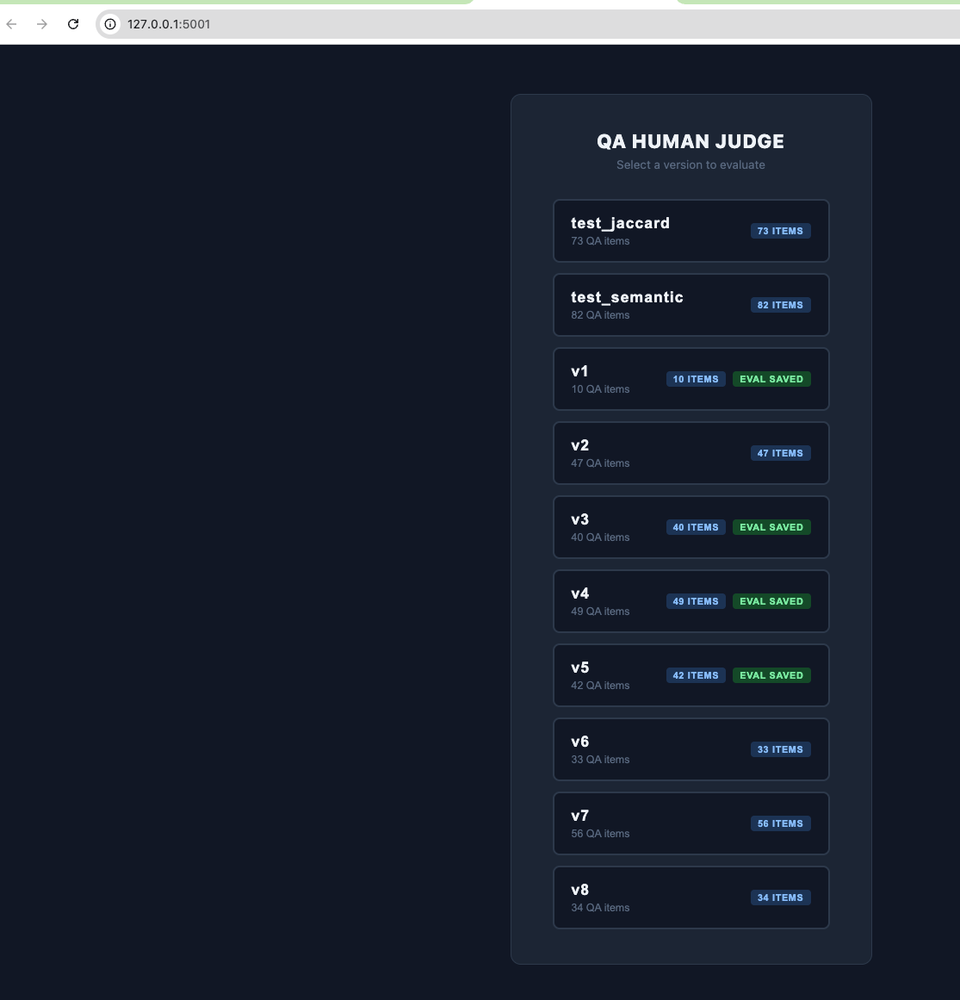
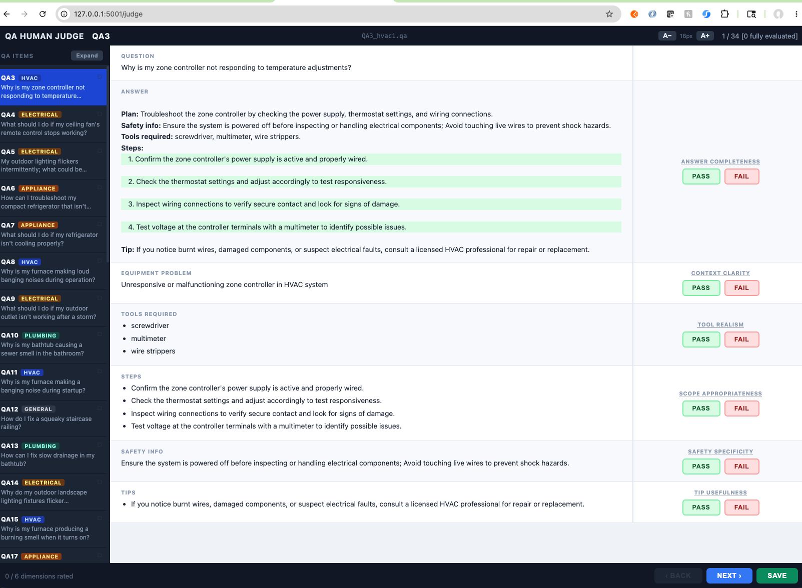
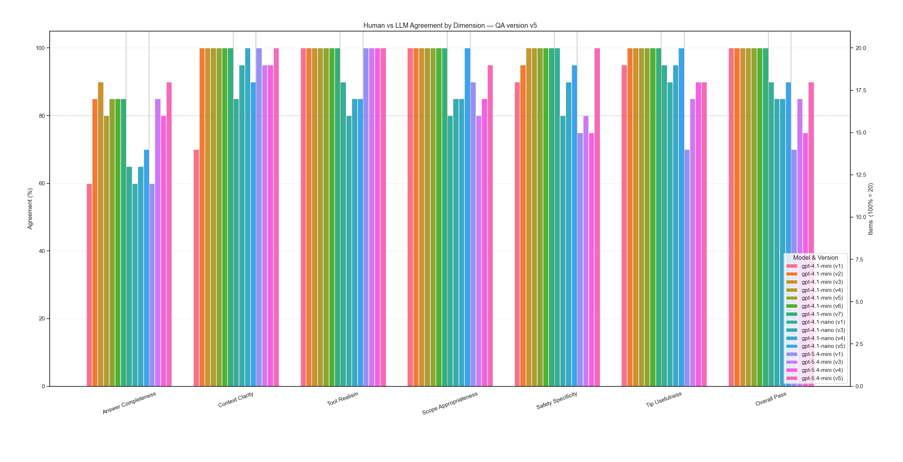
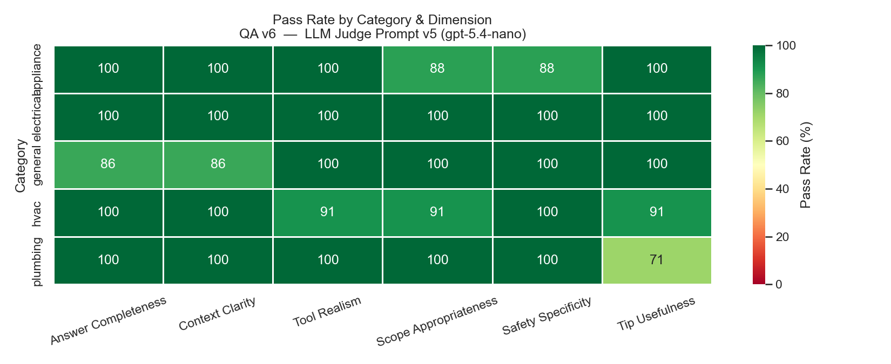
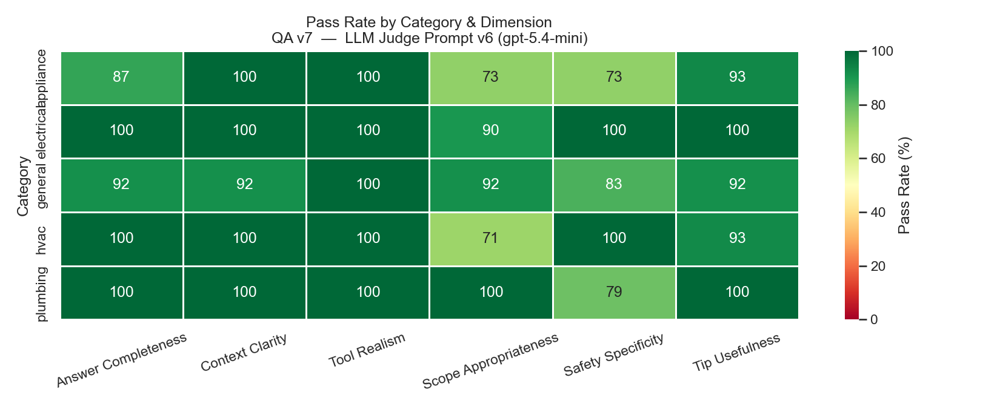
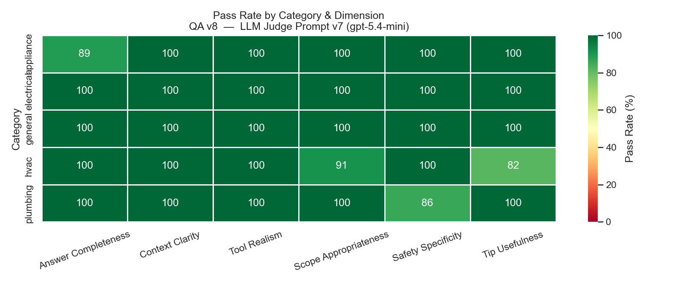
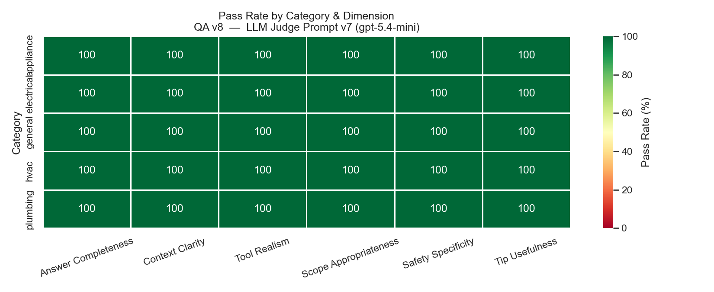

# QA Dataset Generation & Evaluation Pipeline

## Overview

This project is an end-to-end pipeline for generating, validating, and evaluating QA (Question-Answer) datasets for DIY home repair guidance. It uses LLMs (Large Language Models) to automatically generate QA items, validate their quality against a schema, detect duplicates, evaluate them on multiple quality dimensions, and visualize the results.

**Key capabilities:**
- **Generate** QA items in parallel using OpenAI's API with customizable prompts and categories
- **Validate** items against a strict schema (JSON structure, required fields, string lengths, vague phrases)
- **Deduplicate** using both Jaccard similarity and semantic embeddings to catch near-duplicates
- **Evaluate** on 6 quality dimensions: answer completeness, safety specificity, tool realism, scope appropriateness, context clarity, and tip usefulness
- **Visualize** results with charts, heatmaps, and agreement analysis
- **Compare** human vs. LLM evaluations with side-by-side reasoning
- **Orchestrate** the full workflow in a single command

The pipeline is designed for iterative improvement: generate → validate → evaluate → visualize → refine prompts → repeat.

## Setup

### Requirements
- Python 3.8+
- OpenAI API account with available credits

### Installation

1. **Clone the repository**
   ```bash
   git clone https://github.com/your-username/qa-pipeline.git
   cd qa-pipeline
   ```

2. **Create a Python virtual environment**
   
   Using `venv` (recommended for dependency isolation):
   ```bash
   python3 -m venv venv
   source venv/bin/activate    # On Windows: venv\Scripts\activate
   ```

3. **Install dependencies**
   ```bash
   pip install -r requirements.txt
   ```

   **Note:** `sentence-transformers` is commented out in `requirements.txt` (large ~500MB-2GB). Only install if using semantic deduplication:
   ```bash
   pip install sentence-transformers
   ```

4. **Configure OpenAI API Key**

   **Step 1: Create an OpenAI account**
   - Go to [https://platform.openai.com/signup](https://platform.openai.com/signup)
   - Sign up with email or Google/Microsoft account
   - Verify your email address

   **Step 2: Add payment method**
   - Navigate to [https://platform.openai.com/account/billing/overview](https://platform.openai.com/account/billing/overview)
   - Click "Billing" → "Add to account"
   - Add a credit card (required for API access)
   - Set usage limits if desired to control costs

   **Step 3: Generate API key**
   - Go to [https://platform.openai.com/api/keys](https://platform.openai.com/api/keys)
   - Click "Create new secret key"
   - Copy the key (you won't see it again)

   **Step 4: Set environment variable**
   ```bash
   export OPENAI_API_KEY='sk-...'  # Paste your key here
   ```

   To persist across sessions, add to your shell profile (`~/.bashrc`, `~/.zshrc`, etc.):
   ```bash
   echo "export OPENAI_API_KEY='sk-...'" >> ~/.bashrc
   source ~/.bashrc
   ```

## How It Works

All scripts in this pipeline follow a consistent pattern:
- **Interactive prompts**: Scripts present menu choices for versions, models, and parameters with sensible defaults (usually the latest version or highest number)
- **Directory scanning**: Scripts auto-discover available prompt versions, QA item versions, and evaluation files from the project structure
- **Parallel processing**: Most scripts use thread pools for concurrent LLM API calls with configurable parallelism (defaults: 50 for generation, 20 for judging)
- **Flexible inputs**: Scripts can be run standalone via CLI with args, or interactively without args
- **Automatic output management**: Results are logged to `logs/` and artifacts are saved to version-specific directories with timestamps

The pipeline is designed for iterative development: run generation → validate → evaluate → visualize → adjust prompts and repeat.

## Quick Start

To generate and evaluate 50 QA items in under 5 minutes:

1. **Configure API key** (if not already done):
   ```bash
   export OPENAI_API_KEY='sk-...'
   ```

2. **Run the end-to-end pipeline**:
   ```bash
   python app/qa_pipeline.py \
     --gen-model gpt-4.1-nano \
     --gen-version v8 \
     --num-items 50 \
     --judge-model gpt-5.4-mini \
     --judge-prompt-version v7
   ```

3. **View results**:
   ```bash
   python app/judge_visualizer.py
   # Select the newly created version to see charts and pass rates
   ```

## Testing

The project includes a comprehensive test suite covering data validation, QA item schema, batch deduplication, and evaluation visualization.

**Run all tests:**
```bash
python -m pytest tests/ -v
```

**Run specific test file:**
```bash
python -m pytest tests/test_qa_item.py -v
```

**Test coverage:**
- **test_qa_item.py** (14 tests): QAItem Pydantic model validation (question length, answer length, field requirements, list constraints)
- **test_data_validation_checks.py** (16 tests): Data validation checks (JSON validity, required fields, string lengths, vague phrases)
- **test_batch_dedup.py** (7 tests): Jaccard-based deduplication (duplicate detection, preservation of distinct items, malformed file handling)
- **test_judge_visualizer.py** (4 tests): Agreement calculation between human and LLM evaluations
- **test_visualizer_ascii_output.py** (1 test): ASCII table formatting

All 42 tests pass with the current codebase. Tests use pytest fixtures and temporary directories for isolated testing without side effects.

## Pipeline Overview

## **1. Inputs**
- **eval.jsonl & train.jsonl**: External golden test datasets (you don't produce these, only consume for testing)
  - **Format**: JSONL (one JSON object per line) with fields: `id`, `category`, `question`, `answer`, `equipment_problem`, `tools_required` (list), `steps` (list), `safety_info`, `tips` (list)
  - **Usage**: Validation and evaluation baseline for QA quality assessment

- **Prompts**: 
  - `prompts/v*/` - for QA generation:
    - `gen_qa_items.template` - Text template with Python format_map placeholders (`{repair_type}`, `{repair_examples}`, `{repair_type_extra}`) filled from categories.yml
    - `categories.yml` - YAML file mapping category names → fields (repair_type, repair_examples, repair_type_extra); used to generate variant prompts per category
      ```yaml
      plumbing:
        repair_type: plumbing
        repair_examples: faucets (dripping, loose), pipes (leaking, burst), water heaters, drains, clogs, toilets, slow drains
        repair_type_extra: Focus on homeowner-level fixes; recommend professional for sewer line work.
      
      electrical:
        repair_type: electrical
        repair_examples: outlets, circuit breakers, light switches, ceiling fans, wiring, GFCI outlets, smart switches
        repair_type_extra: ""
      ```
    - `gen_qa_output_format_suffix.prompt` - Text file with JSON schema, field constraints, and detailed output format requirements for QA items
  - `prompts_llm_judge/v*/` - for LLM evaluation:
    - `{name}.prompt` - Text files defining judge criteria for 6 quality dimensions (answer_completeness, safety_specificity, tool_realism, scope_appropriateness, context_clarity, tip_usefulness); scored as 0 (fail) or 1 (pass)

## **2. QA Generation** (`generate_qa_set.py`)
- Reads templates & categories from `prompts/v*/`
- Uses LLM to generate items in parallel
- Saves as `QA{num}_{category}{count}.qa` in `qa_items/v*/`
- Archives old items before generating new batch
- **Data structure** (QAItem):
  - question, answer, equipment_problem, tools_required, steps, safety_info, tips

  **Parameters:**
  - `--version VERSION` - Prompt version folder (e.g. v8)
  - `--model MODEL` - LLM model (e.g. gpt-4.1-nano)
  - `--num-items NUM` - Number of items to generate (1-1000)
  - `--temperature TEMP` - Temperature for generation (default: 1.0)
  - `--max-parallel N` - Maximum parallel workers (default: 50)

  **Example:**
  ```bash
  python app/generate_qa_set.py --model gpt-4.1-nano --version v8 --num-items 100 --max-parallel 50
  ```

  **Output:** `qa_items/v8/QA*.qa` (individual item files), `logs/{timestamp}_generate_qa_set.log`

## **3. Validation & Deduplication**

### 3a. Data Validation (`data_validation_checks.py`)
- Validates QA items against QAItem schema
- Checks: JSON validity, required fields, string lengths, vague phrases, duplicates
- Called by default by `qa_pipeline.py` (can be skipped with `--skip-validation` flag)

  **Parameters:**
  - `--version VERSION` - QA items version folder

  **Example:**
  ```bash
  python app/data_validation_checks.py --version v8
  ```

  **Output:** 
  - `logs/{timestamp}_data_validation_checks.log`
  - `qa_items/v8/failed_checks/` (moved items that failed validation)
  - `qa_items/v8/duplicates/` (moved near-duplicate items from dedup check)

### 3b. Semantic Deduplication (`semantic_dedup_check.py`)
- Detects near-duplicate questions using sentence embeddings (cosine similarity)
- Moves duplicates to `qa_items/v*/duplicates/` folder
- Uses all-MiniLM-L6-v2 embedding model

  **Parameters:**
  - `--version VERSION` - QA items version folder (e.g. v8)
  - `--path PATH` - Full path to a QA items folder (alternative to --version)
  - `--threshold THRESHOLD` - Cosine similarity threshold (default: 0.88)

  **Example:**
  ```bash
  python app/semantic_dedup_check.py --version v8 --threshold 0.88
  ```

  **Output:** `qa_items/v8/duplicates/` (moved duplicate files)

## **4. LLM Judging** (`llm_judge.py`)
- Evaluates QA items on 6 dimensions:
  - answer_completeness, safety_specificity, tool_realism, scope_appropriateness, context_clarity, tip_usefulness
- Produces `QA_llm_eval_*.json` with results
- Supports both qa_items folders AND eval.jsonl/train.jsonl (with dynamic rate-limit throttling)
- Handles rate limiting: extracts server-recommended wait times, auto-throttles parallelism

  **Parameters:**
  - `--model MODEL` - LLM model (e.g. gpt-5.4-mini)
  - `--prompt-version VERSION` - Judge prompt version (e.g. v7)
  - `--max-parallel N` - Maximum parallel workers (default: 20)
  - `--evaluate OBJECT` - Path to evaluate (directory, .jsonl, or single .qa file)

  **Example:**
  ```bash
  python app/llm_judge.py --model gpt-5.4-mini --prompt-version v7 --max-parallel 20
  ```

  **Output:** `qa_items/v8/QA_llm_eval_*.json`, `logs/{timestamp}_llm_judge.log`

## **5. Visualization** (`judge_visualizer.py`)
- Shows evaluation results as tables + charts
- Pass rates by dimension, heatmaps, category distribution
- Works with both qa_items versions and JSONL datasets
- Generates PNG charts for analysis

  **Reads from:**
  - For QA versions: `qa_items/v*/` (reads `QA_human_eval.json`, `QA_llm_eval_*.json`, and `*.qa` files for category mapping)
  - For JSONL datasets: Project root `eval.jsonl` / `train.jsonl` and `QA_llm_eval_*.json` files (identified by `evaluated_source` field)

  **Parameters:** (interactive menu, no CLI args)

  **Example:**
  ```bash
  python app/judge_visualizer.py
  # Select version or JSONL dataset to visualize
  ```

  **Output:** `visualizations/{timestamp}/` - human_llm_agreement.png, llm_pass_rates.png, llm_heatmap_*.png, qa_category_distribution.png

## **6. Manual Human Evaluation** (`human_judge.py`)
- Flask web app for manual evaluation of QA items
- Saves evaluations to `QA_human_eval.json` in qa_items version folder
- Evaluates on same 6 dimensions as LLM judge
- Interactive UI with vote tracking (none/partial/full)

  **Parameters:** (interactive Flask app, no CLI args)

  **Example:**
  ```bash
  python app/human_judge.py
  # Opens http://localhost:5000
  # Select version → evaluate items interactively
  ```

  **Output:** `qa_items/v8/QA_human_eval.json`, `logs/{timestamp}_human_judge.log`

## **7. Enhanced LLM Judging with Reasoning** (`enhanced_llm_judge.py`)
- Same as llm_judge but includes reasoning/explanations for each evaluation
- Useful for understanding judge decision logic

  **Parameters:**
  - `--model MODEL` - LLM model (e.g. gpt-5.4-mini)
  - `--prompt-version VERSION` - Judge prompt version
  - `--max-parallel N` - Maximum parallel workers (default: 50)
  - `--only-human-eval` - Only evaluate items that have human judgments

  **Example:**
  ```bash
  python app/enhanced_llm_judge.py --model gpt-5.4-mini --prompt-version v7 --max-parallel 50
  ```

  **Output:** `qa_items/v8/QA_llm_enhanced_eval_*.json`, `logs/{timestamp}_enhanced_llm_judge.log`

## **8. Orchestrator - End-to-end run for QA items generation, validation, judging** (`qa_pipeline.py`)
Runs steps 2-4 in sequence (generation → validation → judging). Automates the full workflow.

  **Parameters:**
  - `--gen-model MODEL` - LLM model for generation
  - `--gen-version VERSION` - Generation prompt version
  - `--num-items NUM` - Number of items to generate (1-1000)
  - `--temperature TEMP` - Temperature for generation (default: 1.0)
  - `--judge-model MODEL` - LLM model for judging
  - `--judge-prompt-version VERSION` - Judge prompt version
  - `--max-parallel N` - Maximum parallel workers
  - `--skip-validation` - Skip data validation step
  - `--skip-judge` - Skip LLM judging step

  **Example:**
  ```bash
  python app/qa_pipeline.py \
    --gen-model gpt-4.1-nano \
    --gen-version v8 \
    --num-items 100 \
    --judge-model gpt-5.4-mini \
    --judge-prompt-version v7 \
    --max-parallel 50
  ```

  **Output:** `qa_items/v8/QA*.qa`, `qa_items/v8/QA_llm_eval_*.json`, `logs/{timestamp}_qa_pipeline.log`

# Development and Iteration process
## Human Judging
### Tools: local Flask app





Flask app allows quickly loading saved results, viewing full QA item and criteria (as pop-up tooltips), one-click Pass/Fail voting for each dimension, saving on-demand, and arbitrary browsing to any item (very helpful during debug).

## LLM judge calibration

Experimented with various LLM models using v5 of generated QA items (after sorting out initial QA quality issues) to identify which judge model performed best. The evaluation criteria included not only agreement with human evaluations, but also cost efficiency and execution speed, to balance quality with practical resource constraints. Please note that I did not keep/generate data for every version for every model, so 4.1-nano and 5.4-mini only illustrate v1,v3,v4,v5.  In some cases I also generated data for other models like gpt-4o-mini, gpt-3.5-turbo, etc. but those results either were worse than the 4.1/5.4 models, or did not add significant value to interating the trend, so I am using 4.1 and 5.4 to show the improvements in LLM judge prompt versions.
The 4.1 mini and nano models were significantly cheaper than 5.4, but the key finding was that **4.1 mini seriously outperformed from the start**, achieving strong human agreement while maintaining cost efficiency. This made it the optimal choice for the pipeline, delivering quality results at a fraction of the expense of larger models.  Nonetheless, I refined the LLM judge prompts so that I could generally see an improvement across all models.  
For example, between v3 and v4 there was a regression:
 - 4.1-mini regressed on "Answer Completeness"
 - 5.4-mini regressed "Answer Completness", "Safety Specificity", and "Overall"

However, this was offset by improvements in the 4.1-nano model in 4 dimensions, with the 5th remaining same.
Additionally, 4.1-nano regressed between v1 and v3 of LLM prompts on 4 of 5 dimensions and 5.4-mini on 2 dimensions, but this was made up by improvements in 4.1-mini and 5.4-mini on 4 dimensions and 3 dimensions.  While this appears to be a net 1 dimension improvement across all models:
 - 5.4-mini's respective dimenions accuracy improvements was a 45% point gain vs a 15% point loss on those it became less accurate in.
 - 4.1-nano lost 40% accuracy points across 4 dimensions, but this was offset by 4.1-mini's 70% point aggregate gain across 4 dimensions for a net 30% gain between these two models alone.

Further, during LLM judge prompt iteration, and because I created an enhanced LLM judge script that ask the LLM to output reasoning as to why a dimension was judged as failed for a given item, I found that I had made mistakes in judging certain QA items myself (mostly by adding false positives, but in some cases being too strict on the criteria).  Its entirely likely that some of the regression that was seen was the new prompt version appearing to regress when in fact it was actually improving in accuracy and convincement me to change my mind. 



## QA Item Generation Prompt Iteration

After initial prompt setup, refinement focused on improving output quality and reducing failures due to invalid JSON, duplicate items, and missing content. Later iterations used dimension-by-dimension analysis from evaluation heatmaps to target specific weak spots in QA items.

**Early refinements (Apr 19 - Apr 26):**
- **Data validation constraints**: Added requirements for minimum field lengths (e.g., steps must be ≥3) and exact key naming to prevent truncated or malformed fields
- **JSON robustness**: Instructed LLM to explicitly escape quotes and validate JSON before output, reducing JSON parsing errors from ~1 per 300 items to near-zero
- **Content consistency**: Restructured prompt to ensure answer section verbatim repeats steps, tips, and safety info from individual sections, eliminating discrepancies

**Variety and deduplication (May 4):**
- **Expanded examples**: Increased example count in generation prompts to encourage variety and reduce duplicate items by >70% across most categories

**Dimension-targeted refinements (May 9+):**

Used evaluation heatmaps to identify and target weak category-dimension pairs:

- **Plumbing × Tip Usefulness (71% → 100%)**: Added explicit guidance on what constitutes useful, non-obvious tips for plumbing repairs.



- **HVAC & Appliances × Scope Appropriateness (33-67%)**: Made safety boundaries explicit—any work involving live voltage, fuses, or refrigerant must include professional referral in steps.
- **Plumbing × Safety Specificity (73% → improved)**: Refined safety_info field to require specific hazard identification + specific precaution pairs (not generic "be careful" phrases).



This dimension-targeted approach allowed systematic improvement of weak spots in the heatmap, moving the pipeline toward consistent high pass rates across all category-dimension combinations.



After additional refinements to v8 of the generator prompt, the pipeline achieved consistent high-quality output using **4.1-mini to generate** QA items and **5.4-mini to judge** their quality:



